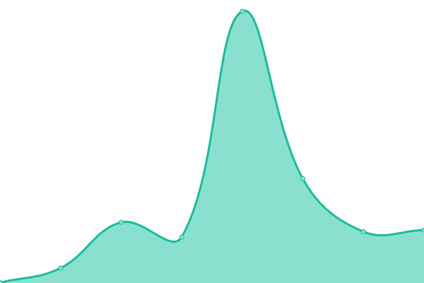

# [📈 Live Status](https://hegrog.github.io/upptime): <!--live status--> **🟧 Partial outage**

This repository contains the open-source uptime monitor and status page for [hegrog](https://hegrog.github.io/upptime), powered by [Upptime](https://github.com/upptime/upptime).

With [Upptime](https://upptime.js.org), you can get your own unlimited and free uptime monitor and status page, powered entirely by a GitHub repository. We use [Issues](https://github.com/hegrog/upptime/issues) as incident reports, [Actions](https://github.com/hegrog/upptime/actions) as uptime monitors, and [Pages](https://hegrog.github.io/upptime) for the status page.

<!--start: status pages-->
<!-- This summary is generated by Upptime (https://github.com/upptime/upptime) -->
<!-- Do not edit this manually, your changes will be overwritten -->
<!-- prettier-ignore -->
| URL | Status | History | Response Time | Uptime |
| --- | ------ | ------- | ------------- | ------ |
|  [Blinlab](https://blinlab.co) | 🟩 Up | [blinlab.yml](https://github.com/hegrog/upptime/commits/HEAD/history/blinlab.yml) | 

 262ms
     
 | 

<a href="https://hegrog.github.io/upptime/history/blinlab">100.00%</a>
    

|  [Posicionato](https://posicionato.co) | 🟩 Up | [posicionato.yml](https://github.com/hegrog/upptime/commits/HEAD/history/posicionato.yml) | 

 269ms
     
 | 

<a href="https://hegrog.github.io/upptime/history/posicionato">100.00%</a>
    

|  [Up The NetWork](https://upthenetwork.com) | 🟩 Up | [up-the-net-work.yml](https://github.com/hegrog/upptime/commits/HEAD/history/up-the-net-work.yml) | 

 251ms
     
 | 

<a href="https://hegrog.github.io/upptime/history/up-the-net-work">100.00%</a>
    

|  [Evolucion TI](https://evolucionti.com) | 🟥 Down | [evolucion-ti.yml](https://github.com/hegrog/upptime/commits/HEAD/history/evolucion-ti.yml) | 

 1447ms
     
 | 

<a href="https://hegrog.github.io/upptime/history/evolucion-ti">53.26%</a>
    

|  [Evolucion TI - EUNO](https://euno.evolucionti.com) | 🟥 Down | [evolucion-ti-euno.yml](https://github.com/hegrog/upptime/commits/HEAD/history/evolucion-ti-euno.yml) | 

 3493ms
     
 | 

<a href="https://hegrog.github.io/upptime/history/evolucion-ti-euno">53.28%</a>
    

|  [Wikipedia](https://en.wikipedia.org) | 🟩 Up | [wikipedia.yml](https://github.com/hegrog/upptime/commits/HEAD/history/wikipedia.yml) | 

 325ms
     
 | 

<a href="https://hegrog.github.io/upptime/history/wikipedia">100.00%</a>
    

|  [Hacker News](https://news.ycombinator.com) | 🟩 Up | [hacker-news.yml](https://github.com/hegrog/upptime/commits/HEAD/history/hacker-news.yml) | 

 313ms
     
 | 

<a href="https://hegrog.github.io/upptime/history/hacker-news">100.00%</a>
    

|  [Test Broken Site](https://thissitedoesnotexist.koj.co) | 🟥 Down | [test-broken-site.yml](https://github.com/hegrog/upptime/commits/HEAD/history/test-broken-site.yml) | 

 0ms
     
 | 

<a href="https://hegrog.github.io/upptime/history/test-broken-site">100.00%</a>
    

<!--end: status pages-->

[**Visit our status website →**](https://hegrog.github.io/upptime)

## 📄 License

- Powered by: [Upptime](https://github.com/upptime/upptime)
- Code: [MIT](./LICENSE) © [hegrog](https://hegrog.github.io/upptime)
- Data in the `./history` directory: [Open Database License](https://opendatacommons.org/licenses/odbl/1-0/)
